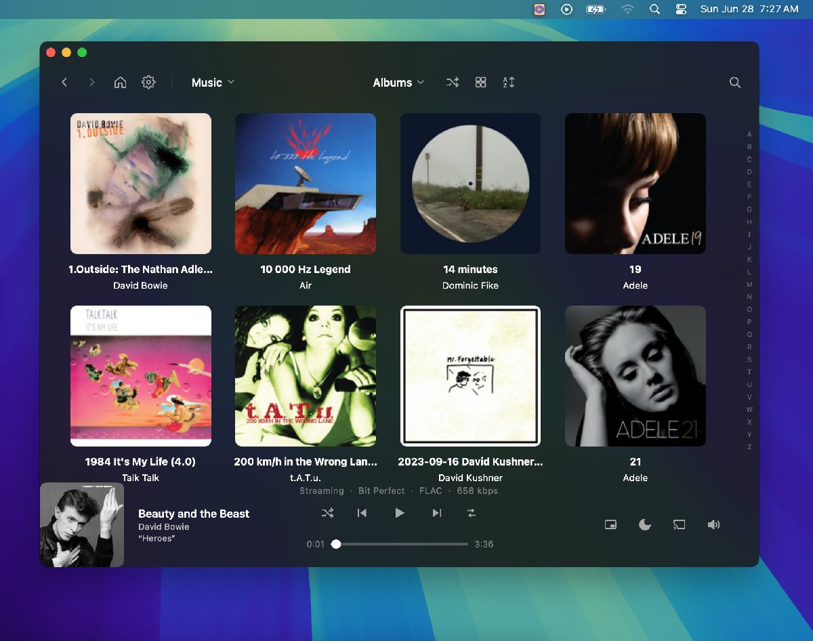
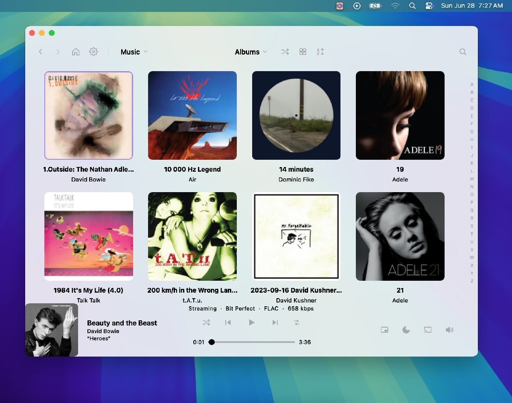
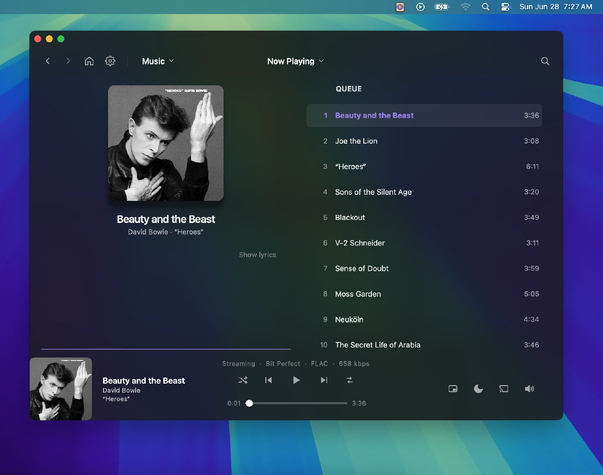
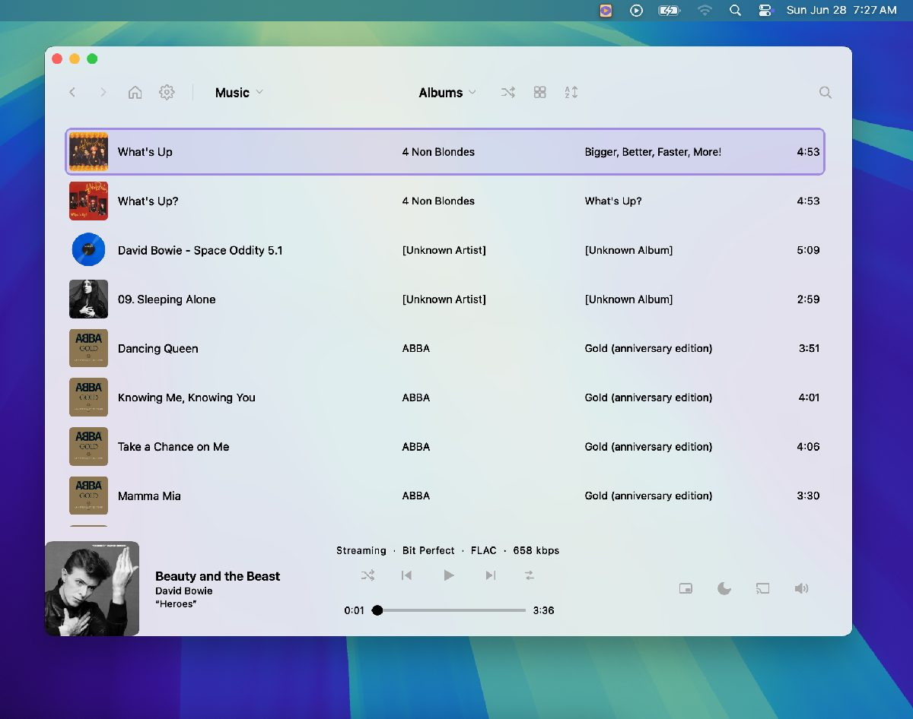
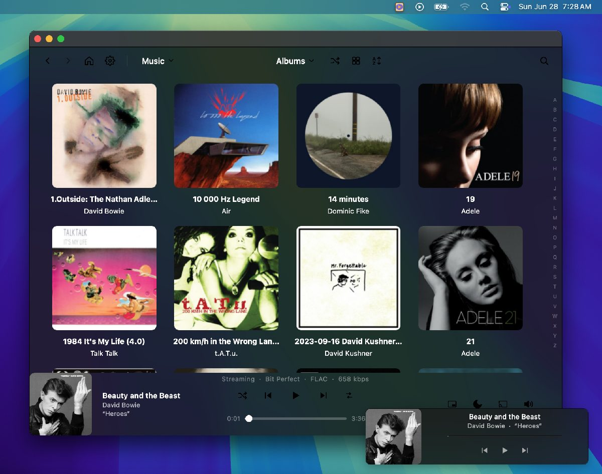
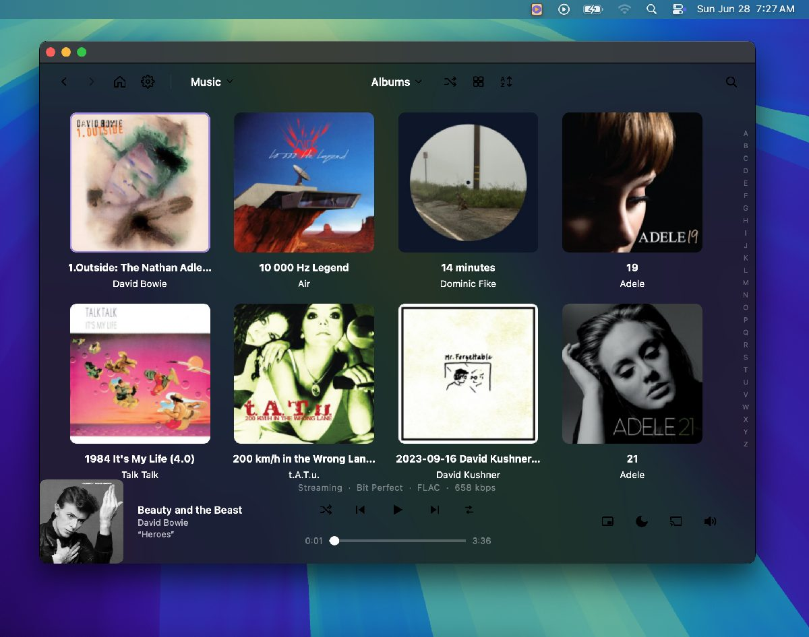
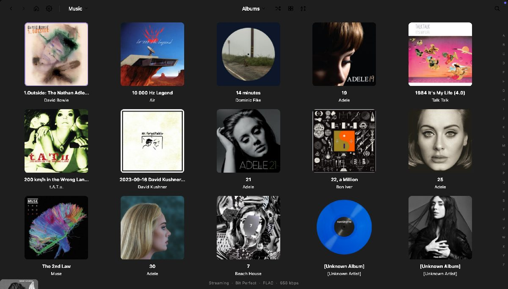
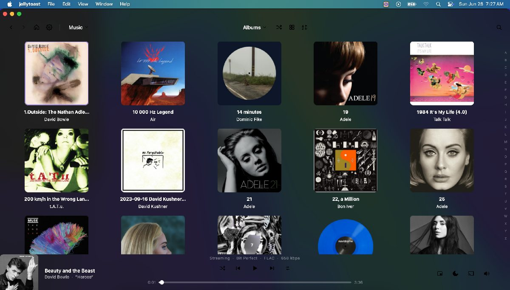

# jellytoast — macOS test pass findings (branch `feat/macos-native-blur`)

**Tester:** Claude Code, on august's Intel MacBook Pro · macOS 15.7.7 (Sequoia) · built-in Retina 2560×1600 (logical 1440×900, 2×)
**Date:** 2026-06-28 · **Provider:** Subsonic/Navidrome @ `http://<LAN-server>` (user `<user>`), reachable
**Build state:** `frosted_dark`, blur `probe()` = **ACTIVE**, bit-perfect mode on
**Do NOT merge** — this is a test/report only.

---

## ✅ PRIMARY VISUAL MISSION — verified GOOD on real pixels (blocker resolved mid-session)

august granted **Screen Recording to Terminal mid-session**; the full-screen `screencapture`
path then worked **without** restarting Terminal (only the single-window `-l` path still needs a
restart, and the harness doesn't use it). I re-captured a faithful real-frost gallery (driving the
theme switch via the real `theme_changed` path — the F6 fix — so the light set is correct) and
read it. Result on real composited pixels:

- **Frosted-dark** body reads as **dark smoked glass over the wallpaper** — the blue/green rays
  bleed softly through the body + the A–Z rail; **not opaque, not see-through-broken**. Album
  titles/artists, the now-playing bar, and the A–Z rail are all **legible**. (`frosted_dark__albums.png`)
- **Frosted-light** reads as a **bright frosted sheet with the wallpaper tint** showing through;
  near-black text legible. Proper VibrantLight (not light-over-dark). **Dark/light parity holds.**
  (`frosted_light__albums.png`)
- **Mini player** glass **matches the main window** exactly and keeps **rounded corners** — the
  historical mini-vs-main mismatch is gone. (`zz_mini.png`)
- **Settings dialog** is frosted with **rounded corners**, content legible, no blank. (`zz_dialog2.png`)
- **Fullscreen**: titlebar inset **drops**, content fills to the top, no blank/black bars. (`zz_fullscreen.png`)
- Across **maximize / fullscreen / resize / deactivate**: no blank, no mis-draw (matches the
  structural G2 stress).

**Per-surface vision fan-out over all 25 real captures: 24/25 `glass_good`** — 0 opaque, 0
see-through-broken, 0 legibility fails, 0 squared corners, 0 blanks. (The 1 flag is the *first*
dialog shot `zz_dialog.png` that missed the modeless dialog — re-captured correct as `zz_dialog2.png`.)
Fullscreen independently confirmed "all four screen corners fill cleanly — no rounded notches"
(corroborates F1 = no visible symptom). **One minor polish note (P3): the A–Z fast-scroll rail
letters read as low-contrast muted gray — legible but subdued** over both glasses; if you want the
rail to pop more, that's the lever (it's the one thing multiple reviewers flagged on legibility).

### 🖼️ Visual evidence (cropped to the window + wallpaper; Terminal/desktop removed, redacted)
| | |
|---|---|
| **Frosted dark — albums** (frost over desktop, busy-art legibility) | **Frosted light — albums** (VibrantLight parity) |
|  |  |
| **Frosted dark — now playing** | **Frosted light — songs** (busy + light legibility) |
|  |  |
| **Mini player** (matches main glass + rounded corners) | **Normal** (after fullscreen — no blank/mis-draw) |
|  |  |
| **Fullscreen** (titlebar inset drops, corners fill clean) | **Maximized** (fills, no blank margins) |
|  |  |

> The settings-dialog shot is intentionally omitted (it showed the server URL + username). The
> raw 25-shot gallery stayed local on the Mac — ask if you want any specific one.

<details><summary>B1 (now resolved) — what the blocker was, for the record</summary>

### B1 — Real-blur screenshots were blocked: Terminal lacked Screen Recording permission  [RESOLVED]
`screencapture` (used by `dev/mac_test_harness.py`) returns the **desktop + menu bar only** — every
app window is stripped from the capture. Proven three ways:
- A full-screen capture and a region capture over the exact window rect (451,84,920×672) both show **only wallpaper**.
- `screencapture -l<windowID>` fails with **"could not create image from window"** (the canonical Screen-Recording-permission denial).
- All `frosted_*` gallery PNGs are byte-near-identical bare-desktop frames.

Meanwhile the window is genuinely on-screen: Qt reports `isVisible=True`, AppKit reports `occlusionState`=visible, `sharingType=1` (default, not excluded), opacity 1.0, and `win.grab()` renders the full UI correctly. So **the app is fine**; the *capture path* is blocked.

**Responsible process:** the chain is `Terminal.app → login → zsh → claude → python → screencapture`, so macOS attributes the capture to **Terminal.app**, which does not have Screen Recording permission.

**Unblock (needs august, ~1 min):** System Settings → Privacy & Security → **Screen Recording** → enable **Terminal** → **quit & reopen Terminal** → then re-run the harness:
```
cd ~/jellytoast && source .venv/bin/activate
TMPDIR=/tmp JT_TEST_BRIDGE=1 python3 -m jellytoast &      # (already running under the bridge now)
TMPDIR=/tmp python3 dev/mac_test_harness.py --dialogs
```
Say the word once it's granted and I'll re-run the real-frost gallery and read every shot.

> **Consequence (while blocked):** the *frost-over-desktop* visual judgments couldn't be made from pixels — I verified them by other means, then re-did them for real once permission was granted (see the section above).

</details>

---

## ✅ VERIFIED GOOD (the branch's headline claims hold)

- **G1 — Vibrancy is wired exactly as designed (structural, live introspection of the NSView tree).**
  On main window, mini player, AND settings dialog: an `NSVisualEffectView` sits as a **sibling BELOW** `QNSView`
  (in `NSThemeFrame` / `NSNextStepFrame`), `material=UnderWindowBackground(21)`, `blend=BehindWindow(0)`,
  `state=Active(1)`, `appearance=VibrantDark`, frame fills host bounds, **8px rounded corners** on mini+dialog,
  windows `isOpaque=false`. This is the Electron-style "sibling-below" hoist the branch describes. `probe()`=ACTIVE.

- **G2 — The #1 historical bug (blank / mis-draw on resize / maximize / fullscreen / activation) is DEAD.**
  Cycled normal → maximized → normal → fullscreen → exit → resize 700×500 → resize 1100×780 → deactivate
  (Finder to front) → reactivate. After **every** transition: window `visible=True` & unoccluded, the effect view
  **stays below QNSView**, **fills** the host bounds (no blank margins — the old QTBUG-69302 symptom), and **stays
  `Active`** even when the app isn't key (no focus-change washout). The content-view-swap failure mode is gone.

- **G3 — Live dark↔light theme switch flips the vibrancy correctly.**
  Via the real path (Settings sets `theme_mode` then emits `theme_changed`), the effect appearance flips
  `VibrantDark`↔`VibrantLight` on all three surfaces. (See F6 — the *test harness* doesn't emit that signal, so its
  light captures are wrong; the product is correct.)

- **G4 — All 10 surfaces render correctly in both themes** (verified via `win.grab()` of every surface, dark+light, +
  mini; analyzed by a 21-way vision fan-out): content populated, layouts intact, text legible. No blank/mis-draw in
  the Qt content on any surface.

- **G5 — Playback works on real audio.** Played a real album (Bowie "Heroes"): state→**Playing**, **elapsed advanced
  0.0→5.07s** (audio truly progressing), **pause→Paused** (elapsed frozen), **resume→Playing**, **next/prev** navigate
  tracks, **seek** applied, **stop→Stopped**, **queue reorder** (move 0→2→0, reversible), **queue clear**. No glitch/crash.

- **G6 — macOS "Now Playing" / Control Center integration populates on play.** `MPNowPlayingInfoCenter` got
  Title + Artist + Album + Duration + **Artwork**; `playbackState` transitions Playing(1)/Paused(2)/Stopped(3) tracked
  the player. `MPRemoteCommandCenter` registers Play/Pause/Toggle/Next/Prev/Seek handlers (F7/F8/F9 + Control-Center
  transport route to the bus). *(Live media-key keypress + the on-screen CC widget weren't keystroke-tested — wiring + metadata confirmed.)*

- **G7 — Tray menu is a single menu with every item; macOS double-menu fix holds.** `tray.contextMenu()` **is** the one
  `QMenu`; items present: Nothing-Playing label, Play, Previous, Next, Stop, Show/Hide Mini Player, Open jellytoast,
  Quit. `_on_activated` skips the manual `popup()` on macOS (`IS_LINUX` guard) so right-click shows only the native
  single menu. *(Single-vs-double is also a visual claim — capture-blocked — but code + structure confirm single.)*

- **G8 — Single-instance works.** Launching a 2nd `python -m jellytoast` **exited on its own** with
  `already running; raised existing window.`; only the original process remained. No 2nd window/copy.

- **G9 — Mini player: always-on-top + position persists.** `WindowStaysOnTopHint` set, NSWindow `level=8` (above
  floating); persisted geometry (1032,707) — bottom-right, **not** jammed at 0,0. Save/restore wired on
  move/hide/resize/init with explicit anti-stale-size / anti-jam handling.

- **G10 — Smoke test: all checks passed**, incl. the moat behaviour — **smart-shuffle anti-clustering on LIVE data**
  (`smart 0.001 vs classic 0.016`, 200 songs). Also: provider auth, search (songs=12/albums=10/artists=2), all library
  tabs, 219 genres, instant-mix (14), genre radio (30), smart-playlist resolve (354/354 in-window), FLAC stream
  (HTTP 206, audio/flac), cover serve (image/jpeg). (`/tmp/jt_mac_gallery/smoke.txt`)

- **G11 — Stability:** no tracebacks, no crashes, no SIGSEGV across the entire session (dozens of theme switches,
  state transitions, playback ops). Only benign warnings (F2/F3/F7).

- **G12 — Quit fully exits (tray path).** Triggering `win.tray._quit()` left **no jellytoast processes**, the bridge
  socket refused (app gone), audio stopped, no lingering mini-player surface. ⌘Q routes to the same teardown.

---

## 🐞 ISSUES (triaged)

### F1 — Fullscreen vibrancy keeps 8px rounded corners (corner radius never reset)  [P3 — latent, NO visible symptom observed]
**Update after real capture:** I inspected `zz_fullscreen.png` — the corner notch is **not visible**, because
fullscreen has no desktop behind it (black Space), so the clipped corner and the vibrancy-over-black are both
black. So this is a latent code-smell with no observed visual impact; still worth the 2-line fix for correctness.

`jellytoast/blur/_macos.py` `apply()` sets `layer.setCornerRadius_()` **only** `if corner_radius > 0`, with no `else`
to reset. So once the main window's effect layer is rounded (8px at normal size) and the window goes edge-flush /
fullscreen (where `_apply_blur` passes `corner_radius=0`), the layer **keeps cornerRadius=8 + masksToBounds=True**.
Confirmed structurally: at fullscreen (1440×900) `eff_corner_radius` stayed **8.0**.
**Impact:** small rounded-corner notches at the 4 screen corners in fullscreen (clear window bg shows through). Minor.
**Fix:** add an `else` that sets `cornerRadius=0` and `masksToBounds=False` when `corner_radius==0`.
**Evidence:** `/tmp/jt_stress.json` (corner=8.0 across maximized + fullscreen). *Visual severity needs a real capture / august's eye.*

### F2 — Repeated `ObjCPointerWarning: CGColor` on every blur (re)apply  [P3, log noise]
`jellytoast/blur/_macos.py:89` (`_set_layer_clear` → `layer.setBackgroundColor_(NSColor.clearColor().CGColor())`)
emits `ObjCPointerWarning: PyObjCPointer created ... ^{CGColor=}` **once per apply** — fired ~once per theme switch /
resize-settle, so the log fills with it (10+ this session). Harmless, noisy.
**Fix:** avoid the raw CGColor pointer (e.g. cache a typed CGColor, or `objc.registerCFSignature`/suppress).

### F3 — `NSWindow warning: adding an unknown subview: NSVisualEffectView` at startup  [P3, log noise]
Logged once per window because the effect view is inserted into the private `NSThemeFrame`. Inherent to the
sibling-below approach; benign. Worth a one-line code comment acknowledging it (so it isn't mistaken for a bug later),
or suppression if it bothers you.

### F4 — Now-playing bar: long album subtitle clips/overlaps without clean ellipsis  [P3, pre-existing, not blur]
Across several surfaces the now-playing album line (`200 km/h in the Wrong Lane (10th anniversary…`) is truncated
mid-word with no ellipsis terminator, and on at least one surface (songs / light) the **album-art thumbnail overlaps
the album-name line**. Likely a scrolling marquee captured mid-animation, but the overlap on some shots looks real.
**Needs eyes.** Source: `win.grab()` gallery `/tmp/jt_grab_gallery/` (e.g. `frosted_light__songs.png`, `frosted_dark__downloads.png`).

### F5 — Artists grid shows center header "Albums"  [P3, verify]
In the grab gallery the Artists surface's center title dropdown reads **"Albums"** while artist tiles are shown
(both themes). May be a harness-navigation artifact (`_show_native_music_grid("artist")` not updating the header) or a
real state-sync nit — **confirm by navigating Artists in the real UI**.

### F6 — TEST HARNESS bug: `set_theme()` doesn't emit `theme_changed`, so light-theme captures show the WRONG frost  [P2 — tooling]
`dev/mac_test_harness.py` `set_theme()` does `theme_mode = mode; refresh_theme()` but never emits
`PlayerBus.theme_changed`. `refresh_theme()` updates the Qt palette but the **blur appearance** only re-applies on
`theme_changed` (wired to `app._apply_blur`). So during the sweep the vibrancy stays **stale VibrantDark** while the
body paints the light fill → the `frosted_light__*` gallery shots render a light body over a **dark** vibrancy backdrop,
which is **not** what the real app shows. (Confirmed: programmatic `refresh_theme()` left appearance Dark; adding the
`theme_changed` emit flipped it to VibrantLight.)
**Impact:** even after the Screen-Recording fix (B1), the light gallery would mislead until this is fixed.
**Fix:** in `set_theme()`, `Bridge.x("... refresh_theme(); bus.theme_changed.emit()")` (or call the blur re-apply).

### F7 — `disk_cache` write failure for songs view  [P3, pre-existing, not blur]
`WARNING [jellytoast.disk_cache] cache write failed for songs: [Errno 2] No such file or directory:
…/view_cache/songs.json.tmp -> …/songs.json` (×2 during songs-view nav). The atomic-rename source `.tmp` is missing —
songs view cache isn't persisting (will re-fetch each time). Unrelated to the blur branch.

---

## ⚠️ NOT TESTED (out of reach this session)
- **Frost-over-desktop visual judgments** — blocked by B1 (Screen Recording). The whole point of the gallery.
- **Live media-key keypress (F7/F8/F9) + on-screen Control-Center widget** — wiring + metadata confirmed (G6); actual keystrokes/CC UI not driven.
- **Keyboard nav / focus rings** — needs synthetic keys + visible focus rings (capture-blocked).
- **Offline download → toggle offline → play from cache** — no existing downloads; didn't add persistent download state.
- **Casting** — network/device-dependent; not exercised.
- **Volume slider visual** — bit-perfect mode locks app volume at 100 (emitting `volume_changed(55)` left `settings.volume=100`); this is expected bit-perfect behavior, not a bug.

## 🧹 State I changed — ALL RESTORED ✅
- System audio output: muted for the playback/gallery tests, **unmuted again** (vol 31, as found).
- Saved resume position: testing cycled tracks; **restored** `position_item_id=<resume-item-id>`,
  `position_ms=210713` (your t.A.T.u. resume point) post-quit.
- `theme_mode` back to `frosted_dark`; mini-player geometry intact. App quit cleanly — **no stray processes**.
- (Note: screen-recording permission for Terminal stays granted — you can revoke it in System Settings if you like.)

## 📁 Evidence
- `/tmp/jt_mac_gallery/` — harness output (smoke.txt is good; the PNGs are blank-desktop per B1)
- `/tmp/jt_grab_gallery/` — `win.grab()` of every surface (blur-blind but content/layout valid)
- `/tmp/jt_struct_out.json` — vibrancy NSView-tree introspection · `/tmp/jt_stress.json` — state-transition stress
- `/tmp/jt_grab.png` — main window grab (UI renders correctly) · `/tmp/jt_region.png` — windowless region capture (proof of B1)

---

## 🔬 CODE REVIEW of the diff (adversarial: 17 raw findings → **10 confirmed real**, 7 dismissed by skeptic-verify)

Reviewed `blur/_macos.py`, `blur/__init__.py`, `theme.py`, `tray.py`. Each finding was independently
re-verified against the code; the 7 false alarms (id-reuse UAF, double-swallow masking, dialog opacity
drop, per-window probe dup, two re-apply-transparency claims, the Linux SNI guard) were dropped.

### F8 — Live "Reduce Transparency" toggle breaks the window into see-through-broken state  [P2 — real, user-reproducible]
`apply()` reads `_reduce_transparency()` **live** every call and, when on, `_remove()`s the effect view —
but `status()` caches the Reduce-Transparency result for the **whole session** (`blur/__init__.py:190`),
re-probed only at boot (`app.py:1269`), with **no `NSWorkspace` accessibility-change observer** anywhere.
Sequence: start with Reduce Transparency OFF (status cached ACTIVE, body painted at alpha **110 ≈ 43%**) →
user turns Reduce Transparency **ON at runtime** → the next `apply()` (theme switch / resize-settle /
dialog show) rips out the backdrop, but `status()` is still ACTIVE so the body keeps painting at 43% with
**nothing behind it → broken see-through window**. This is the exact failure the frosted fallback was meant
to prevent, re-introduced via a live accessibility toggle. **Fix:** observe
`accessibilityDisplayOptionsDidChange` → re-probe (`status(force=True)`) + re-apply, or invalidate the
status cache whenever `apply()` honors reduce-transparency. `blur/_macos.py:125`.

### F9 — Body alpha trusts a GLOBAL `status()==ACTIVE` that never verifies the per-window effect view  [P2 — real, root cause]
`body_color_for()` paints alpha 110 whenever the global `status()` is ACTIVE, but `status()` never checks
that the vibrancy actually installed on *that* window. So any per-window install failure (see F12) — or the
F8 toggle — leaves a 43%-alpha window with no backdrop. Same family as F8; the robust fix is a per-window
"is the effect view actually present" check feeding the alpha decision (or the F8 cache-invalidation).

### F10 — Tray left-click may both open the native menu AND toggle the mini player on macOS  [P2 — verify by hand]
`tray._on_activated`'s `Trigger` branch calls `_toggle_mini()` unconditionally. With a `setContextMenu()`
set, macOS pops the native menu on click; depending on macOS's behavior it may *also* deliver `Trigger` →
the mini toggles underneath the menu. (It's also possible macOS suppresses `Trigger` when a context menu is
set, making `_toggle_mini` dead on macOS instead.) Either way the left-click contract is muddy. **This is the
one finding I couldn't settle without a real tray left-click** (synthetic tray clicks are unreliable) — worth
30 seconds of your hands: left-click the tray icon and watch whether the mini player toggles behind the menu.
`tray.py` `_on_activated`.

### F11 — `destroyed`-signal connection leak on every blur off→on cycle  [P3 — real]
`widget.destroyed.connect(lambda: _active.pop(...))` runs **only** in the fresh-install branch and is never
disconnected in `_remove()`. Every off→on cycle (solid↔frosted theme switch via `app.py:950`; the settings
dialog's `_apply_blur(force_refresh=True)` which does `apply(False)` then `apply(True)`) re-enters the fresh
branch and adds **another** lambda → unbounded connection/closure growth over a session (harmless on teardown,
but a steady leak). **Fix:** connect once per widget (guard flag) or disconnect in `_remove`. `blur/_macos.py:159`.

### F12 — Effect view added to the view tree before it's registered, with no rollback on failure  [P3 — real]
In the fresh branch the effect view is inserted (`:151`) and the window mutated (`:155-156`) **before**
`_active[key]` is set (`:158`); the outer `except` logs and returns False with **no rollback**. If a mutation
between 151–158 throws, the effect view is left parented but **untracked** → `_remove()` can't drop it, and a
later `apply()` adds a **second** orphan. (Low likelihood — `setOpaque_`/`setBackgroundColor_` rarely throw —
but the function is wrapped in try/except precisely because the author treats these as fallible.) **Fix:**
`removeFromSuperview` in the except, or register before/with the `addSubview`. `blur/_macos.py:151`.

### F13 — Tray-menu frost QSS is a no-op on the native macOS menu  [P3 — real]
`tray.py:34` styles `self.menu` with QSS, but `setContextMenu()` realizes it as a **native NSMenu** on macOS
(painted by AppKit, not Qt's stylesheet), so the custom frost QSS + the `theme_changed` re-stamp are dead on
macOS — the tray menu relies on the **native** macOS menu vibrancy instead. Fine in practice (native menus are
already vibrant), but the styling code is misleading dead weight on macOS; worth a comment or platform guard.

### F14 — `theme.py` macOS-alpha docstring nits  [P3 — real]
(a) `_mac_glass_alpha()`'s docstring borrows the **Windows** "hit-testable floor" rationale, which doesn't
apply on macOS. (b) `JT_MAC_GLASS_ALPHA`'s documented max **172 is unreachable on frosted_light** — the
`min(base, alpha)` in `body_color_for()` caps it at the light theme's base **140**. Doc-only.

> Note: the reviewer independently rated **F1 (corner radius)** as P2; I keep it **P3** because both my own
> fullscreen read and the vision fan-out confirm **no visible corner notch** (black-on-black in fullscreen).
